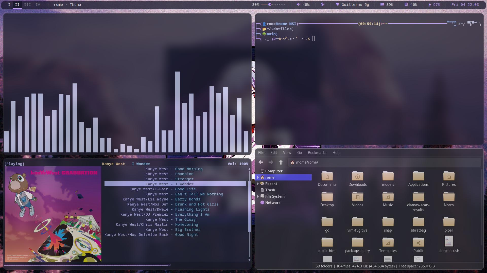
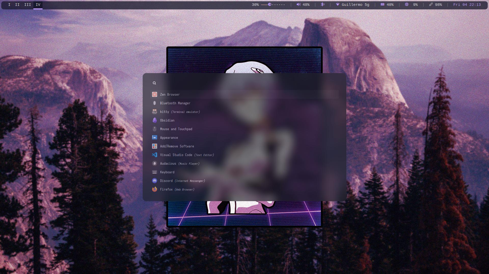
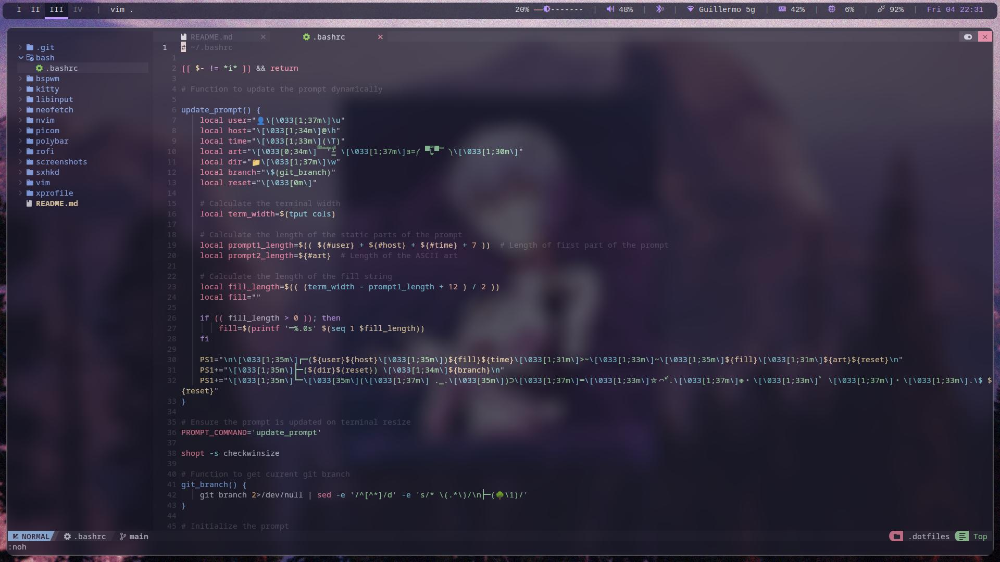

# 👨‍💻 My Dotfiles

Welcome to the rice field — enjoy my dotfiles 👋

---

## 🖥️ What I'm Using

### 🪟 Window Manager & Essentials
- **BSPWM** — Tiling window manager
- **sxhkd** — Hotkey daemon for all shortcuts
- **picom** — Compositor (transparency, shadows, etc.)
- **kitty** — Terminal emulator
- **Thunar** — Lightweight file manager
- **Rofi** — Application launcher and powermenu

---

## ⚙️ Some Apps in Action

### 🗃️ General Setup


### 🚀 Rofi Launcher


### 📝 Neovim Config


---

## 📂 What's Inside This Repo

This repo is managed with [GNU Stow](https://www.gnu.org/software/stow/) for easy symlink management.
```
~/.dotfiles/
├── bash/           # .bashrc
├── bspwm/          # BSPWM window manager config
├── kitty/          # Kitty terminal config
├── libinput/       # Libinput gestures config
├── neofetch/       # Neofetch config
├── nvim/           # Neovim config
├── picom/          # Picom compositor config
├── polybar/        # Polybar config
├── rofi/           # Rofi launcher config
├── screenshots/    # Screenshots for previews (not symlinked)
├── sxhkd/          # Sxhkd hotkey daemon config
├── vim/            # .vimrc
├── xprofile/       # .xprofile
└── README.md       # You're reading this!
```
---

## 🚀 Quick Setup

```bash
# Clone the repo
git clone https://github.com/yourusername/dotfiles.git ~/.dotfiles

# Enter the dotfiles
cd ~/.dotfiles

# Symlink with stow
stow bspwm sxhkd kitty picom rofi bash nvim neofetch
```
